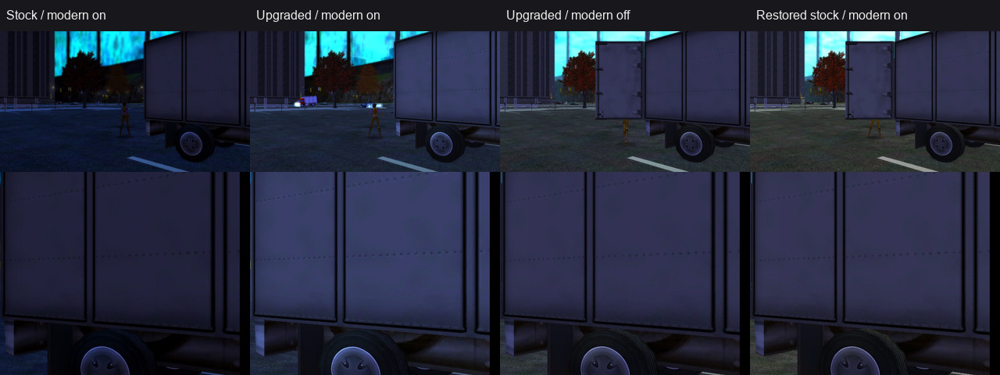

# Issue #20 — Founders truck texture modernization pilot

## Scope and starting point

- Issue: [#20](https://github.com/joshcatania/cohsourcedev/issues/20)
- Starting commit: `20e44c9d902b0f4c0ae1bee756311c1dbf6b3f83`
- Working branch: `agent/texture-modernization-pilot`
- Target: `FoundersCanal_01`, map `10`
- Camera override: `4494.28 0.00 992.15 0.2500 0.7854 0.0000`
- Capture response: `-glslPilot 1 -modernMaterials 1 -modernPresentation 0 -modernBloom 0`

This pilot changes only the selected truck base and normal/gloss assets. It does not repack or modify any pigg, process character textures, change renderer/material behavior, alter post-processing, or exceed the supported 1024px texture limit. The only source additions are strictly gated diagnostics for proving the selected runtime layers and source paths.

## Runtime layer identification

The pinned truck is the `Cubevan_side` bind (`GEO_Chest`, submesh 4) in the accepted Founders capture. Its runtime layers are:

| Layer | Runtime asset | Stock logical/real size | Stock file metadata |
| --- | --- | ---: | --- |
| `BASE1` | `NPCS/Vehicles/Car_Truck/Cubevan_side` | 256×256 / 256×256 | flags `0x41`, texopt `0xcc`, surface `0x20`, gloss `1.0000`, 87,536 bytes |
| `MULTIPLY1` | `white` | — | untouched packed asset |
| `BUMPMAP1` | `NPCS/Vehicles/Car_COMMON/carsheen_bump_02` | 64×64 / 64×64 | flags `0x841`, texopt `0x10c0`, surface `0x0`, gloss `1.0000`, 5,616 bytes |
| `DUALCOLOR1` | `white` | — | untouched packed asset |
| `MASK` | `NPCS/Vehicles/Car_Truck/Cubevan_side_mask` | 256×256 / 256×256 | flags `0x40`, texopt `0xc0` |
| `BASE2` | `NPCS/Vehicles/Car_Truck/Cubevan_side` | 256×256 / 256×256 | same base asset |
| `MULTIPLY2` | `universal_window_reflect5C` | — | untouched packed asset |
| `BUMPMAP2` | `NPCS/Vehicles/Car_COMMON/carsheen_bump_02` | 64×64 / 64×64 | same normal/gloss asset |
| `DUALCOLOR2` | `white` | — | untouched packed asset |
| `ADDGLOW1` | `black` | — | untouched packed asset |

The front bind (`Cubevan_frnt`, `GEO_Chest`, submesh 3) uses the same base and normal/gloss pair, plus `Cubevan_frnt_mask`; this confirms the pair is the shared vehicle material input rather than a scene-only texture.

Both selected files resolve from `stage1c.pigg` in the stock run:

```text
texture_library/NPCS/Vehicles/Car_Truck/Cubevan_side.texture
texture_library/NPCS/Vehicles/Car_COMMON/carsheen_bump_02.texture
```

The stock files were extracted into a temporary directory with the repository's existing `pig.exe` extraction command (`pig.exe x <stage1c.pigg> -C<temporary-directory>`). The extracted files were read and hashed; `stage1c.pigg` was not rewritten.

| Extracted file | Bytes | SHA-256 |
| --- | ---: | --- |
| `Cubevan_side.texture` | 87,753 | `397B1DFA4BE426E5BB2CFC205CAB0C77D60F3CBE62D8177C651BC887B73642F0` |
| `carsheen_bump_02.texture` | 5,838 | `64E0944836182CDC822F3F6B3D9076DC4C302FA6C205639D7C378B28A34D3BD7` |

`GetTex -texinfo` confirmed the stock containers are TX2/DXT5. The base is `DUAL`, 256×256, with a binary alpha channel. The bump file is `CLAMPS|CLAMPT|BUMPMAP`, 64×64, and its source payload is standard RGB normal data with authored gloss in alpha: RGB decoded to the constant normal direction `(123,125,255)` and alpha values range from 93 through 109.

## Reversible loose-asset gate

The client runs with `FolderCache` mode `2` (`FOLDER_CACHE_MODE_I_LIKE_PIGS`) and data root `./data`. The loose override must therefore be under `bin/data/texture_library/...`; a sibling `bin/texture_library` copy is outside the active data root and was correctly ignored.

The exact extracted stock bytes were copied to these loose paths and only their filesystem timestamps were advanced so the existing folder-cache timestamp rule selected them:

```text
bin/data/texture_library/NPCS/Vehicles/Car_Truck/Cubevan_side.texture
bin/data/texture_library/NPCS/Vehicles/Car_COMMON/carsheen_bump_02.texture
```

The exact-byte loose gate passed in `agent/logs/capture-FoundersCanal_01-20260818-042826.json`. Its runtime trace reports both files as:

```text
mode=2 dataDir=./data
kind=loose resolved=./data/texture_library/...
```

After the upgraded capture and the `modernMaterials 0` control, both loose files were moved out of the active data root. The restore capture passed in `agent/logs/capture-FoundersCanal_01-20260818-045116.json`; its trace reports both files as:

```text
kind=pigg resolved=./piggs/stage1c.pigg:/texture_library/...
```

This is the required reversible extraction/override proof. No pigg was repacked, replaced, or mutated.

## Conservative modernization

Only this pair was processed:

- `Cubevan_side`: 256×256 → 512×512. RGB was enlarged with Lanczos and a restrained unsharp pass; alpha used nearest-neighbor replication and retained the stock binary set `{0,255}`.
- `carsheen_bump_02`: 64×64 → 128×128. RGB was enlarged as vectors, renormalized per output texel, and re-encoded. Alpha used nearest-neighbor replication, retaining all 17 authored gloss values and the stock range 93–109.

The native GLSL material path samples `normal_gloss.xyz` as a signed normal and `normal_gloss.w` as gloss. Packaging was therefore performed in an isolated temporary workspace with standard RGB-normal/alpha-gloss DXT5 payloads; the stock `BUMPMAP` header metadata was restored afterward without applying a DXT5nm channel swizzle that would overwrite gloss alpha semantics.

The upgraded files are generated into a caller-selected temporary output root; they are not committed under the live `bin/data` override path. The wrapper's current rerun produced:

| File | Container bytes / TX2 payload bytes | SHA-256 |
| --- | ---: | --- |
| `Cubevan_side.texture` | 349,897 / 349,680 | `E10F0E7C3ECF6278F6B9058F932A3EF7B4B00B31CA2DAE8B842D3619EC1C3613` |
| `carsheen_bump_02.texture` | 22,222 / 22,000 | `68F91388ABA8A3ECA10D54E5B5421C0E5D72B52E8F5A5A4E5C95186FDD72FDC4` |

The outputs are two explicit pilot files only; there is no batch converter or extracted asset dump in the change. The committed branch is stock-by-default: `bin/data/texture_library/NPCS/Vehicles/Car_Truck/Cubevan_side.texture` and `bin/data/texture_library/NPCS/Vehicles/Car_COMMON/carsheen_bump_02.texture` are absent until the install action explicitly copies generated output into place.

The two TX2 payloads grow from 93,152 stock bytes to 371,680 pilot bytes (+278,528, about 3.99×). This is the on-disk compressed-payload proxy for the two-texture memory cost; no renderer or VRAM allocator was changed.

## Reproducible wrapper and explicit state changes

The committed wrapper is [agent/texture-pilot.ps1](../agent/texture-pilot.ps1), backed by [agent/texture_pilot.py](../agent/texture_pilot.py). It accepts the two locally extracted stock `.texture` files, extracts their DDS payloads, performs the same conservative base/normal-gloss transforms, invokes the existing GetTex/NVIDIA texture-tool path, restores the stock logical names and layer flags, and verifies the exact pilot hashes before returning success.

After extracting only the two files to a local temporary directory with the existing pig tool:

```powershell
$stock = 'C:\path\to\extracted\texture_library'
$pilot = Join-Path $env:TEMP 'coh-issue20-texture-pilot'

.\agent\texture-pilot.ps1 -Action Generate `
  -StockBase "$stock\NPCS\Vehicles\Car_Truck\Cubevan_side.texture" `
  -StockNormalGloss "$stock\NPCS\Vehicles\Car_COMMON\carsheen_bump_02.texture" `
  -OutputRoot $pilot

.\agent\texture-pilot.ps1 -Action Install -OutputRoot $pilot
# Run the pinned capture here; the runtime trace must report kind=loose.
.\agent\texture-pilot.ps1 -Action Remove -OutputRoot $pilot
# Run the pinned capture again; the runtime trace must report kind=pigg.
```

`Generate` writes only to the selected temporary output root. `Install` explicitly copies the two generated files into `bin/data/texture_library/...` and advances only their filesystem timestamps for the existing folder-cache precedence rule. `Remove` deletes exactly those two loose paths and leaves the packed stock files untouched. `Utilities/GetTex/src/gettex.c` now accepts the optional `COH_GETTEX_LOCK_PATH` environment variable used by the wrapper for a temporary writable lock; the default remains `c:\gettex.lock`.

## Visual and control evidence

The upgraded run passed with `modernMaterials 1`, captured in `agent/logs/capture-FoundersCanal_01-20260818-044505.json`. The command exited cleanly and its trace selected both upgraded files as `kind=loose`.

The scoped `modernMaterials 0` guard passed in `agent/logs/capture-FoundersCanal_01-20260818-045043.json` with the same loose pair and clean client exit. The stock restore run above passed with `modernMaterials 1` and returned to packed selection.

The contact sheet shows the full scene and a fixed crop of the truck's right-hand body panel/wheel (`x=720..1278`, `y=50..619`) so the comparison is not dominated by the animated left door:



Metrics for this scene are recorded in [issue20-texture-metrics.json](evidence/issue20-texture-metrics.json). The captures are intentionally treated as visual evidence, not pixel-regression baselines: weather, exposure convergence, and the truck's door animation vary between fresh client launches. The stable body-panel crop shows the upgraded run preserves the stock material response while adding only the intended higher-resolution base/normal detail.

## Validation

- `agent/doctor.ps1 -Json`: passed; the existing v142 probe warning remains non-blocking and the v145 fallback is the verified Release/x86 toolchain.
- `agent/build.ps1 -Configuration Release -Platform x86`: passed in `agent/logs/build-Release-x86-20260818-051655.log` after adding the wrapper's optional GetTex lock-path support; renderer/material behavior is unchanged.
- Direct-DB character/map smoke: passed in `agent/logs/smoke-directdb-20260818-052528.json`.
- Wrapper generation: reproduced both pilot hashes exactly and verified dimensions, base alpha `{0,255}`, 17 gloss-alpha values `93..109`, and normalized pre-package vectors.
- Stock exact-byte loose gate: passed in `agent/logs/capture-FoundersCanal_01-20260818-042826.json`.
- Clean wrapper install + upgraded `modernMaterials 1`: passed in `agent/logs/capture-FoundersCanal_01-20260818-053330.json`; both selected files traced as `kind=loose`.
- Stock restore after wrapper removal: passed in `agent/logs/capture-FoundersCanal_01-20260818-053409.json`; both selected files traced as `kind=pigg`.
- The prior upgraded `modernMaterials 0` guard remains in `agent/logs/capture-FoundersCanal_01-20260818-045043.json`; the rerun generated byte-identical pilot files, so no visual/art result changed.

The two source diagnostics in `Game/src/render/rendermodel.c` and `Game/src/render/tex.c` are strictly gated to the pinned target, capture state, GLSL pilot, and the two selected texture paths. They do not alter lookup, material selection, shader behavior, or runtime asset data.
